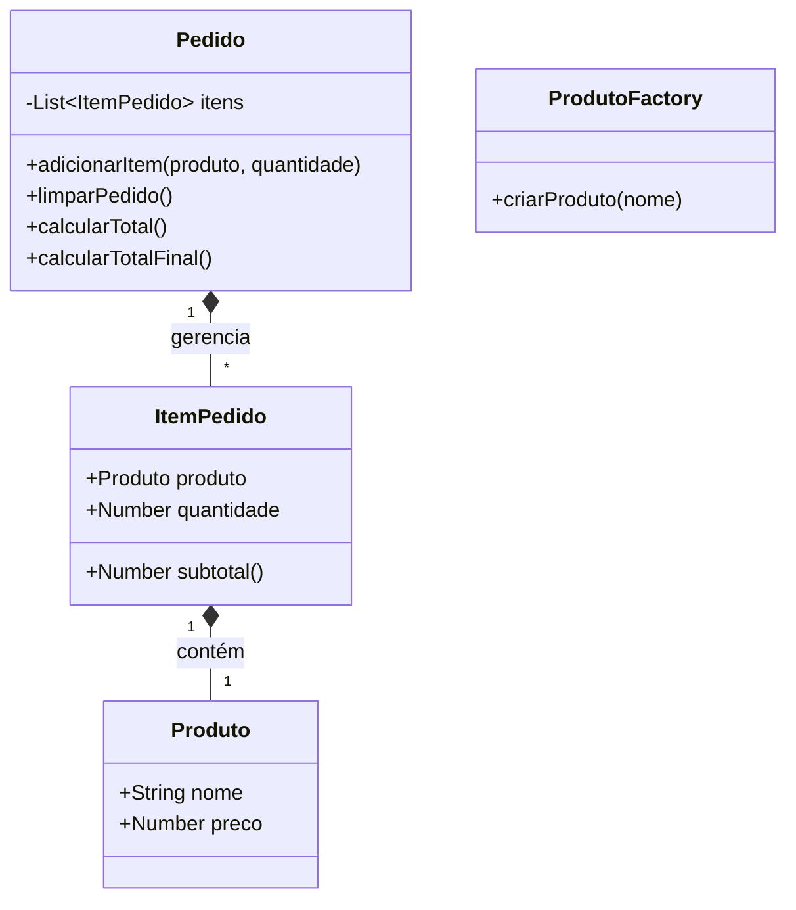

# Análise e Refatoração do Sistema de Pedidos

## Parte 1 – Compreensão do Sistema
1. **Qual é o objetivo do sistema?**
   O objetivo do sistema é permitir que o usuário adicione produtos de uma pastelaria (pastel, caldo, refrigerante, suco) a um carrinho de compras, calcule o subtotal e o total, e finalize o pedido aplicando possíveis descontos e taxas.
2. **Quais são suas principais funcionalidades?**
   - Adicionar itens ao pedido.
   - Listar itens adicionados com suas quantidades e subtotais.
   - Calcular e exibir o total do pedido em tempo real.
   - Finalizar o pedido, aplicando regras de desconto e taxas, e salvando o último pedido no localStorage.
   - Limpar a tela e os dados do pedido atual.
3. **Como o usuário interage com o sistema?**
   Através de uma interface web simples onde ele seleciona um produto através de um menu *dropdown* (select), informa a quantidade desejada através de um campo numérico, e clica em botões para adicionar ao pedido ou finalizar a compra. A lista de itens e o total são atualizados dinamicamente na tela.

## Parte 2 – Identificação de Elementos
1. **Quais são as principais funções do sistema?**
   No código original, as funções identificadas são: `adicionar()`, `atualizarLista()`, `salvarTotal()`, `finalizar()`, `limparTudo()`, `removerUltimo()`, e `calcularTotal()`.
2. **Quais dados são manipulados?**
   - Nome do produto, quantidade, preço unitário e subtotal por item.
   - Total do pedido, taxa e desconto aplicados no final.
   - O armazenamento no `localStorage` do total e do valor final do último pedido.
3. **Quais entidades podem ser extraídas (ex: classes)?**
   - `Produto` (representando os itens disponíveis no menu com seus preços).
   - `ItemPedido` (representando um produto escolhido e a quantidade).
   - `Pedido` ou `Carrinho` (responsável por gerenciar os itens, calcular o total, aplicar descontos/taxas).
   - `UIController` (para gerenciar a interação do DOM).

## Parte 3 – Arquitetura
1. **O sistema possui arquitetura definida? Justifique.**
   Não. O sistema não possui uma arquitetura bem definida. Toda a lógica de negócio, manipulação do DOM e acesso a dados (localStorage) está misturada no mesmo arquivo e acoplada diretamente em funções globais, sem separação de responsabilidades.
2. **Ele segue algum padrão (MVC, camadas, etc.)?**
   Não. O código é monolítico, onde as funções de visualização (`atualizarLista`) executam lógica de negócio (cálculo de total) e acesso a dados (`salvarTotal`), e funções de negócio (`adicionar`) buscam valores diretamente de elementos HTML pelo ID.
3. **Como você classificaria esse sistema?**
   É um script procedural ("Spaghetti Code"), voltado puramente para a execução sem preocupação estrutural ou modular.

## Parte 4 – Modelagem
**Diagrama de Classes (UML):**

## Parte 5 – Análise de Problemas
- **Coesão:** Muito baixa. Funções fazem múltiplas coisas. A função `adicionar()` pega dados da tela, descobre o preço do produto, calcula o subtotal e avisa a interface para atualizar.
- **Acoplamento:** Muito alto. O JavaScript está diretamente acoplado ao HTML. As regras de negócio conhecem detalhes da interface.
- **Separação de responsabilidades:** Inexistente. Acesso ao DOM, regras de negócio e manipulação do armazenamento estão nas mesmas funções.
- **Duplicação de código:** Há um loop para somar os subtotais dentro de `atualizarLista()`, e ao mesmo tempo existe uma função `calcularTotal()` repetindo a lógica.
- **Organização geral:** Variáveis globais soltas (`itens`, `total`), preços hardcoded e falta de classes.

## Parte 6 – Propostas de Melhoria
- **Organização em camadas:** Separar o código em Camada de Apresentação (UI/DOM) e Camada de Regras de Negócio (Modelos).
- **Criação de classes:** Criar classes para `Pedido`, `ItemPedido` e `Produto`.
- **Aplicação de padrões de projeto:**
  - **Factory:** Para criar as instâncias de `Produto` com os preços corretos baseados na seleção.
  - **Singleton:** Para garantir que tenhamos apenas um objeto `Pedido` (carrinho) gerenciando os itens durante a execução da aplicação.
- **Melhorias no código:** Remover variáveis globais, eliminar códigos duplicados, remover acoplamento entre regras de cálculo e manipulação do DOM.

## Parte 7 - Refatoração
A refatoração foi realizada reestruturando o `script.js`:
- **Separação de responsabilidades:** Foram criadas classes específicas para Modelo (`Produto`, `ItemPedido`, `Pedido`), Regras de Negócio de Interface (`UIController`), e Persistência (`StorageController`).
- **Melhoria de funções:** Funções globais como `adicionar()`, `atualizarLista()` e `finalizar()` foram movidas para `UIController`. O cálculo do total foi centralizado na classe `Pedido`, eliminando o loop duplo e funções não utilizadas.
- **Organização do código:** O código agora utiliza classes do ES6, encapsulando os dados, eliminando variáveis globais e desacoplando a manipulação do DOM das regras de negócio.

## Parte 8 – Aplicação de Padrões de Projeto
Durante a refatoração, implementamos:

### Padrão Factory
- **Onde foi aplicado:** Na classe `ProdutoFactory`, através do método estático `criarProduto(nome)`.
- **Por que foi utilizado:** Para centralizar a lógica de instanciação de produtos. Em vez de espalhar lógicas de `if/else` ou `switch` diretamente na interface (`UIController.adicionar()`) para atribuir preços baseados no nome, o controlador simplesmente pede um objeto "pastel" à Factory, e recebe um objeto `Produto` completo, instanciado com o preço correto correspondente à regra de negócios.

### Padrão Singleton
- **Onde foi aplicado:** Na classe `Pedido`, através do uso da propriedade estática `instance`.
- **Por que foi utilizado:** O Singleton garante que apenas uma única instância do "carrinho" de compras (`Pedido`) exista por ciclo de vida da aplicação. Assim, instanciar ou acessar `Pedido` sempre retornará a mesma lista de itens, garantindo a centralização e controle consistente dos dados do usuário. Isso evita bugs onde uma parte do código atualiza um pedido enquanto outra lista outro.
